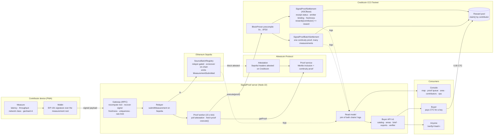
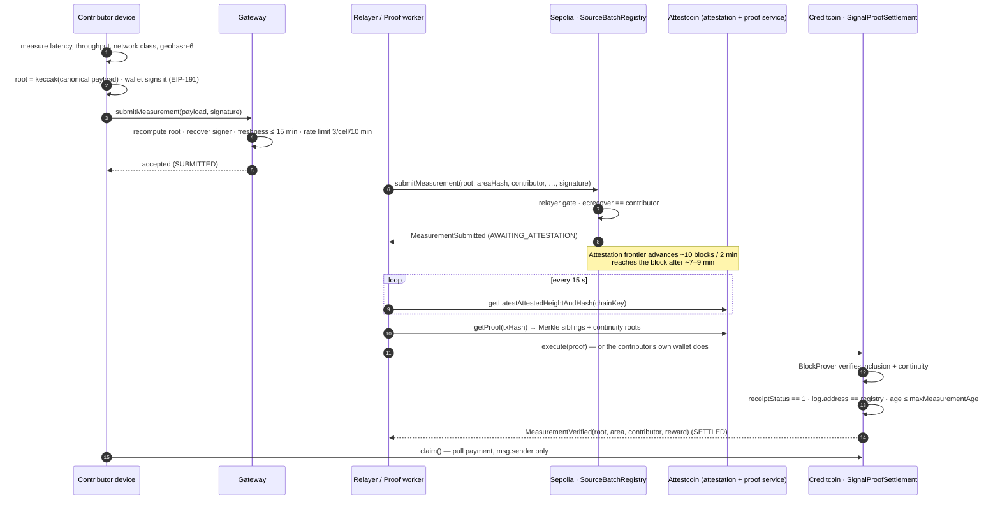
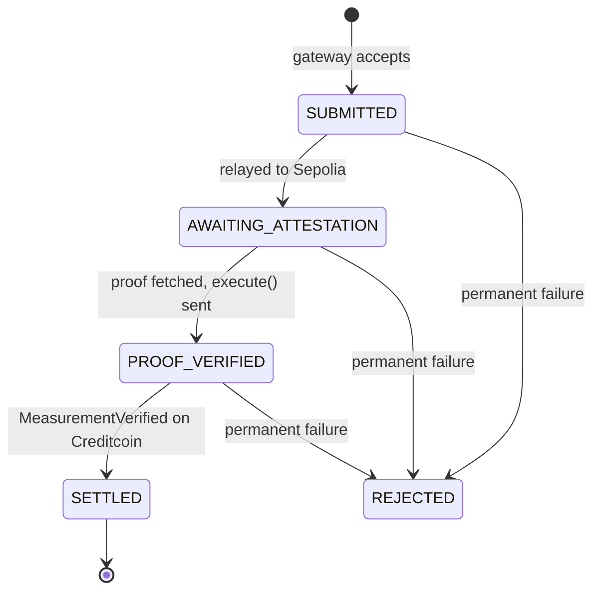
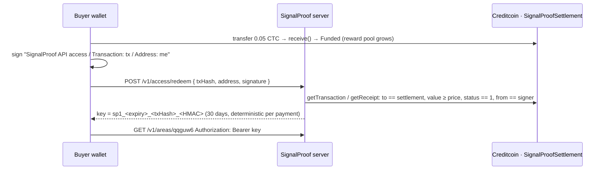

<p align="center"></p>

<h1 align="center">SignalProof</h1>

<p align="center"><strong>Verifiable connectivity data for DePIN — measured on phones, committed on Ethereum Sepolia, proven by the Attestcoin Protocol, settled and rewarded on Creditcoin.</strong></p>

<p align="center">
  <a href="https://signalproof.mdloglabs.org"></a>
  
  
  
</p>

<p align="center">
  <a href="https://signalproof.mdloglabs.org">Live app</a> ·
  <a href="https://signalproof.mdloglabs.org/docs">Documentation</a> ·
  <a href="docs/deck/SignalProof-deck.pdf">Deck (PDF)</a> ·
  <a href="docs/TECHNICAL_ARCHITECTURE.md">Technical architecture</a> ·
  <a href="https://dorahacks.io/hackathon/buidl-ctc-2026-fall/detail">Hackathon</a>
</p>

---

## Overview

Anyone can *claim* coverage numbers; nobody can *prove* them. Operators buy drive tests and crowdsourced quality reports whose provenance is a spreadsheet. SignalProof makes the claim checkable:

1. A phone measures real network conditions — latency, throughput, network class and a **coarse area** (a geohash cell of ~1.2 km × 0.6 km; the raw coordinate never leaves the device).
2. The measurement is committed as a hash on **Ethereum Sepolia**, signed by the contributor and verified on-chain.
3. The **Attestcoin Protocol** attests the Sepolia block on Creditcoin and produces an inclusion proof.
4. A contract on **Creditcoin CC3 Testnet** verifies the proof through the BlockProver precompile and accrues a reward to the contributor — the only party that decides what is real, and it trusts nobody but the proof.
5. Buyers pay CTC **into that same reward pool** for per-area data with provenance down to the transaction.

Everything below is deployed and running on testnet: **24 settled measurements from 9 contributors across 4 cells** as of 2026-09-13, one paid API purchase on chain, and a dashboard whose every number is a join of the two chains' logs — no database required.

## Live deployment

| Component | Where | Link |
|---|---|---|
| Application | `https://signalproof.mdloglabs.org` | [Console](https://signalproof.mdloglabs.org) · [Verifier](https://signalproof.mdloglabs.org/verify) · [Ops](https://signalproof.mdloglabs.org/ops) · [Docs](https://signalproof.mdloglabs.org/docs) |
| `SourceBatchRegistry` | Ethereum Sepolia (11155111) | [`0x32c0923cD58523864D2727FCaaB109783664c236`](https://sepolia.etherscan.io/address/0x32c0923cD58523864D2727FCaaB109783664c236) |
| `SignalProofSettlement` | Creditcoin CC3 Testnet (102031) | [`0x8F14B2cC1b807203d332DE6E3DA6274176FDb584`](https://creditcoin-testnet.blockscout.com/address/0x8F14B2cC1b807203d332DE6E3DA6274176FDb584) |
| `SignalProofBatchSettlement` | Creditcoin CC3 Testnet (102031) | [`0x3B90e22f246bBa68f6de682b564c33b121D68C85`](https://creditcoin-testnet.blockscout.com/address/0x3B90e22f246bBa68f6de682b564c33b121D68C85) |

All contracts are verified on their explorers. A retired registry (`0x15F3…59Dc`, relayer-gated without the on-chain signature) is still read for history via `RETIRED_REGISTRIES`.

**Proof of life on chain**

| What | Transactions |
|---|---|
| Single measurement through the signed registry, 9.8 min end to end | Sepolia [`0xbd7261…7223`](https://sepolia.etherscan.io/tx/0xbd7261e655c751f9a38acc116808acd3a0c0b0fd14279fe4fad207c742d57223) → Creditcoin [`0x60d9e4…a2b5`](https://creditcoin-testnet.blockscout.com/tx/0x60d9e438e8549a101b144bd1e474475301c696640062601ddfd18f788e6aa2b5) |
| Three measurements settled under one continuity proof | Creditcoin [`0xcf1a01…9598`](https://creditcoin-testnet.blockscout.com/tx/0xcf1a01c55052ef604494ee53c717f9401019d7fb56c6681fb1e11f2559c49598) (3 × `MeasurementVerified` + `BatchSettled`) |
| Contributor `claim()` | Creditcoin [`0x148536…0030`](https://creditcoin-testnet.blockscout.com/tx/0x14853610d5d9ae99ade6fdca0cb3c0ead461d29baf252b18c2cfa48b83fe0030) |
| First paid API access, into the reward pool | Creditcoin [`0xed00a0…8d30`](https://creditcoin-testnet.blockscout.com/tx/0xed00a0b6dd4ee0b4d4760665b0bedf3cdb7279dd0b5ded0124a5925021e08d30) (pool 4.997 → 5.047 CTC) |

## Architecture



The Creditcoin contract is the only place that decides whether a measurement is real. It does not trust the gateway, the relayer or the submitter — only the proof, and two checks the precompile leaves to the application (see [Attestcoin integration](#attestcoin-protocol-integration)).

### Measurement lifecycle





`canTransition` encodes the machine as data, so the worker cannot present an unproven measurement as settled; `SETTLED` is terminal. Transient failures back off (15 s → 30 min, five attempts); permanent ones — forged emitter, already-settled root, reverted source transaction — stop immediately.

## Attestcoin Protocol integration

`SignalProofSettlement` inherits `ASCBase` from `@gluwa/asc-contracts` and overrides one hook, `_processAndEmitEvent`. The BlockProver precompile at `0x…0FD2` verifies Merkle inclusion and continuity; `ASCBase` deduplicates by query id; the application logic runs only after both pass.

### The two checks the precompile does not perform

The precompile proves exactly one thing: the transaction was included in a block that genuinely belongs to the attested source chain. It does **not** prove the transaction succeeded, and it does **not** prove which contract emitted the logs inside it.

```solidity
// 1. Inclusion is not success.
if (receipt.receiptStatus != 1) revert SourceTransactionFailed(receipt.receiptStatus);

// 2. Emitter binding. Without this, anyone deploys a lookalike registry on Sepolia, emits a
//    byte-identical MeasurementSubmitted naming themselves, proves it, and drains the pool.
if (log.address_ != sourceRegistry) revert WrongEmitter(log.address_, sourceRegistry);
```

**Check 2 is missing from the `SimpleMinterASC` example on the Attestcoin documentation site.** It is present in Gluwa's own `ASCLoanManager`, which ships a regression test for it. We mirror both: `test_rejectsWrongEmitter`, and the whole-system attack in [`contracts/test/EndToEnd.t.sol`](contracts/test/EndToEnd.t.sol) (`test_forgedRegistryCannotSettleEvenWithValidProof`), where an attacker controls a registry, emits an identical event and holds a proof the precompile accepts — only the binding stops them.

### Protocol details handled explicitly

| Detail | What we do | Why |
|---|---|---|
| `chainKey` | Resolved at startup from `getSupportedChains()`, matched on `chainId === 11155111` | It is a `uint64`; the chain returns `chainName` hex-encoded, so name matching finds nothing; key `1` means a different chain on CC3 Mainnet |
| Attestation wait | Poll `getLatestAttestedHeightAndHash` once per tick | `waitUntilHeightAttested` blocks 8–20 min and would freeze the queue |
| `getProof` | Check `.success`, then unwrap `.data` | It returns `ProofResult`, not `ContinuityResponse` |
| `ProofBuilder` | 120 s timeout + own backoff | The default is 10 s with no retry |
| `estimateGas` | try/catch, manual fallback, 35 % buffer | Estimation fails against precompiles even when the call succeeds |
| Event reading | From the receipt, never a filter | Public RPCs expire filters |
| Deploy | `forge create`, not `forge script` | CC3 headers carry no `mixHash`; Foundry's simulation aborts on `prevrandao` |
| Batch route | `executeBatch` drives the precompile's batch `verifyAndEmit`, which `ASCBase` does not wire | One continuity proof for many measurements; capped at 50 entries because the marginal cost *rises* with batch size (`BatchGasProbe.t.sol`) |
| Double settlement | The batch contract skips roots the single-proof contract already paid (`siblingSettlement`, `staticcall` with explicit success check) | Two routes, one registry: the same genuine measurement must not be paid twice |

## Product surface

| Route | For | What it shows |
|---|---|---|
| `/` | operators | Coverage map (geohash cells drawn at their real resolution, prefix search, quality filter), KPIs, quality trend, proof queue with the live Attestcoin proof and **Settle from my wallet**, data products |
| `/?mode=measure` | contributors | Real measurement in the browser (PWA-installable), wallet-signed; **auto-measure** every 10 minutes |
| `/verify/<hash>` | anyone | A measurement root, Sepolia tx or Creditcoin tx → commitment, attestation, proof, settlement; never metered |
| `/area/<geohash>` | buyers | The cell, quality over time, every sample with provenance, CSV/JSON export, brief, embeddable badge |
| `/contributors[/<address>]` | contributors | Leaderboard; per-address history, earned/claimed/unclaimed, `claim()` |
| `/ops` | operators | Relayer balances, pool runway in settlements, worker and RPC health, attestation lag |
| `/docs` | everyone | Eleven documentation pages, also readable on GitHub under [`docs/site/`](docs/site) |

### Buyer API



| Endpoint | Access | Returns |
|---|---|---|
| `GET /v1/areas` | free | Every measured cell with aggregates |
| `GET /v1/access` · `POST /v1/access/redeem` | free | Terms; key issuance |
| `GET /v1/verify/{hash}` | free | Both chains' view of a measurement plus the proof |
| `GET /v1/areas/{geohash}/badge.svg` | free | Embeddable quality badge |
| `GET /v1/areas/{geohash}` | key | Aggregates and every sample with `sourceTxHash`, `creditcoinTxHash`, `verifyUrl` |
| `GET /v1/areas/{geohash}/brief` | key | Markdown brief a buyer can forward |
| `GET /v1/areas/{geohash}/export.csv` · `export.json` | key | Bulk export |

The key travels as `Authorization: Bearer <key>` or `?key=<key>` on a link; gated responses are `Cache-Control: private`. Keys are HMACs over the payment — nothing is stored, so there is no replay to defend and the same payment always yields the same key. **What is sold is the service** — aggregation, the provenance join, briefs, exports, uptime — not the data, which is public on two chains and free on the dashboard. Without `BUYER_ACCESS_SECRET` the gate is open and the purchase card is hidden, so a keyless clone keeps working.

```bash
curl -s https://signalproof.mdloglabs.org/v1/areas                                  # catalog
curl -s https://signalproof.mdloglabs.org/v1/verify/0x60d9e438e8549a101b144bd1e474475301c696640062601ddfd18f788e6aa2b5
curl -s -H "Authorization: Bearer $KEY" https://signalproof.mdloglabs.org/v1/areas/qqguw6/export.csv
```

## Security model

| Party | Can | Cannot |
|---|---|---|
| Contributor | Attribute a measurement to itself (signature recovered on-chain), `claim()` its own accrual, self-settle any proven measurement | Claim for another address, alter a signed payload (gateway: `MEASUREMENT_ROOT_MISMATCH`) |
| Relayer | Withhold a measurement (liveness) | Forge attribution, move a reward, make the contract accept an event the registry did not emit |
| Anyone | Call `execute()` with a valid proof, verify any hash, read the catalog | Settle the same root twice (per route and across routes), settle a lookalike registry's event |
| Buyer | Fund the pool and receive a key | Redeem someone else's payment (`SIGNER_MISMATCH`), forge a key |

Four findings from our own review are kept as **inverted exploit tests**, so reopening a hole fails a test instead of quietly working: the permissionless first registry (`AdvUnlimitedMint.t.sol`), the same measurement paid on both routes (`DoubleSettlement.t.sol`), a poisoned batch (`BatchPoison.t.sol`), and a relayer-named payee (`SourceBatchRegistry.t.sol`, with a signature vector shared byte for byte with the TypeScript client).

Other properties: pull-payment rewards (no value moves on the verification path), `execute()` permissionless by design, the public API never returns `signature`/`nonce`/`sessionHash`, secrets never reach the client, the dashboard read model never shrinks on a flaky RPC read.

**Known limitations** — stated so a judge does not have to find them: the relayer is still the admission point (offline relayer stalls new measurements; already-committed ones can be settled by anyone); anti-Sybil is a per-cell rate limit, not device attestation; the reported cell is self-declared by the client; buyer keys cannot be revoked individually and there is no retention policy; read direction only (Sepolia → Creditcoin); attested ≠ finalized (attestation runs ahead of Sepolia's `finalized` tag); end-to-end latency is 9–13 minutes, so a demo pre-warms a proof.

## Getting started

Requirements: **Node 22+**, **pnpm 10**, **Foundry** (contracts). MySQL is optional — without `DATABASE_URL` the store is in-memory and the dashboard still reads the chain.

```bash
git clone --recursive https://github.com/mdlog/signalproof.git && cd signalproof
pnpm install
cp .env.example .env      # pre-filled with the live testnet deployment — no key needed to read
pnpm dev                  # http://localhost:3000 — real settlements, no database
```

| Variable | Purpose |
|---|---|
| `SEPOLIA_RPC_URL`, `CREDITCOIN_RPC_URL`, `ATTESTCOIN_PROOF_SERVICE_URL` | Chain reads and proofs (keyless) |
| `SOURCE_BATCH_REGISTRY_ADDRESS`, `SETTLEMENT_CONTRACT_ADDRESS`, `BATCH_SETTLEMENT_ADDRESS` + `*_DEPLOY_BLOCK`, `RETIRED_REGISTRIES` | What to read; deploy blocks keep the first paint fast |
| `SEPOLIA_RELAYER_PRIVATE_KEY`, `CREDITCOIN_RELAYER_PRIVATE_KEY` | Enable relaying and settling (funded burners) |
| `PROOF_WORKER_MODE` | `full` (default) or `relay-only` — leave settlement to contributors' wallets |
| `BUYER_ACCESS_SECRET`, `BUYER_ACCESS_PRICE_CTC`, `BUYER_ACCESS_DAYS` | Metered buyer API; open gate when the secret is unset |
| `VITE_WALLETCONNECT_PROJECT_ID` | Optional; enables WalletConnect for phone wallets (build-time) |
| `DATABASE_URL`, `JWT_SECRET` | Optional persistence; session secret |

The first chain read after a cold start takes ~20 s on the public CC3 RPC; every read after that is served from a single-flight, stale-while-revalidate cache. Run only one proof worker per relayer key — two workers race on nonces.

### Verify

```bash
pnpm verify        # tsc --noEmit + 185 Vitest + 75 Foundry tests
pnpm smoke         # keyless read-path check: resolved chainKey, attestation lag
pnpm e2e:surface   # 28 live checks of the product surface (E2E_BASE=https://host to target a deployment)
pnpm e2e:live      # one measurement end to end against the live chains, ~9 min
pnpm e2e:batch     # three measurements under one continuity proof
```

### Deploy

```bash
docker build -t signalproof . && docker run --rm -p 3000:3000 --env-file .env signalproof
```

`fly.toml` and `render.yaml` are included (`fly secrets set …` / Render Blueprint). Contracts: `pnpm deploy:check`, then `pnpm deploy:all` (Sepolia → CC3 → fund the pool); `contracts/deploy.sh` documents each step.

## Repository layout

```
contracts/                 Foundry — SourceBatchRegistry, SignalProofSettlement, SignalProofBatchSettlement, 75 tests
server/signalproof/        gateway helpers, relayer, proof worker, chain read model, buyer API, access keys,
                           verifier, area exports, contributors, ops, live e2e scripts
server/routers.ts          tRPC gateway
shared/                    measurement canonicalisation + signing message, geohash, quality score, auto-measure schedule
client/src/                React 19 console: pages per route, AppShell, RainbowKit wallet, measurement client, docs site
docs/                      technical architecture, deck, submission package, docs-site markdown
```

## Documentation

- [Documentation site](https://signalproof.mdloglabs.org/docs) — introduction, quickstart, concepts, architecture, Attestcoin integration, contracts, API, security, operations, FAQ, changelog (source in [`docs/site/`](docs/site))
- [`docs/TECHNICAL_ARCHITECTURE.md`](docs/TECHNICAL_ARCHITECTURE.md) — as-built architecture and status machine
- [`docs/deck/SignalProof-deck.pdf`](docs/deck/SignalProof-deck.pdf) — 12-slide deck
- [`docs/JUDGE_QA.md`](docs/JUDGE_QA.md) — the hard questions, answered

## Credits and license

Built on the [Attestcoin Protocol](https://docs.attestcoin.org/) by Gluwa; contract patterns follow [`gluwa/attestcoin-protocol-examples`](https://github.com/gluwa/attestcoin-protocol-examples) (Apache-2.0). Submission to [BUIDL CTC 2026 Fall](https://dorahacks.io/hackathon/buidl-ctc-2026-fall/detail), DePIN track.

MIT — see [LICENSE](LICENSE).
